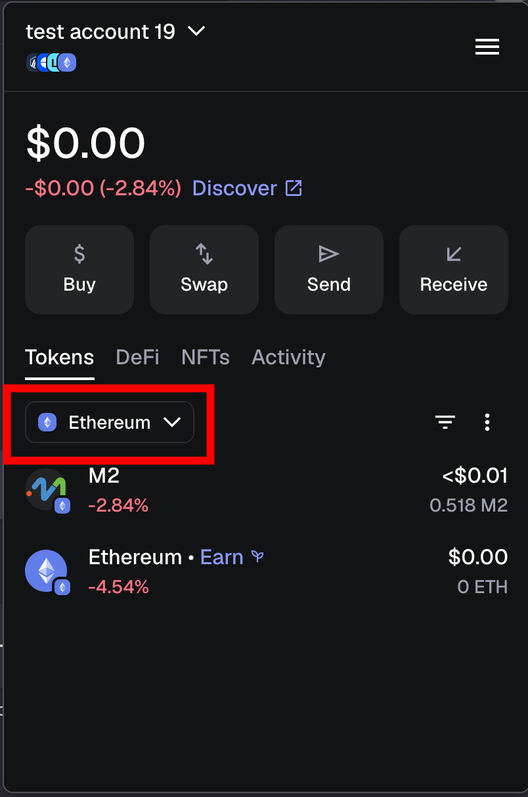
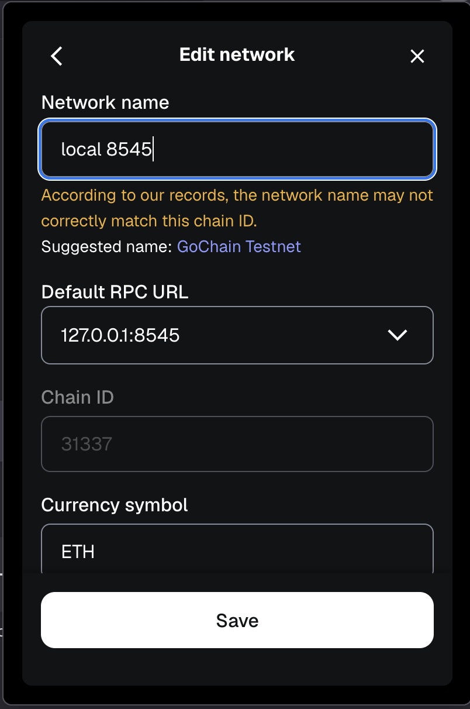
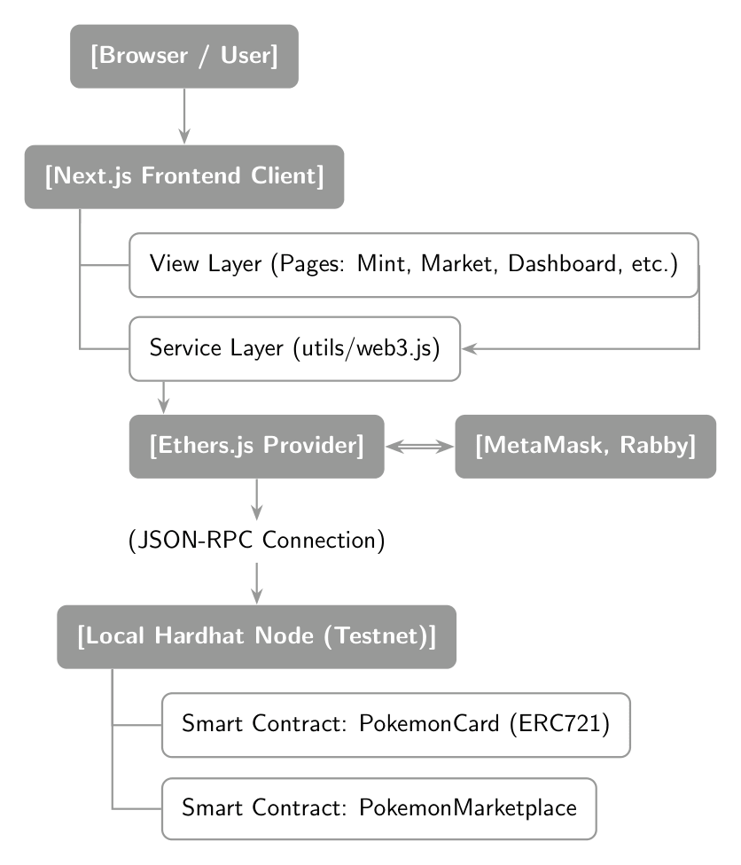

# Decentralized Pokemon Card NFT Project
This project is a Decentralized Application (dApp) deployed on a local Hardhat testnet, using the **Ethereum ERC721** contract standard.
The frontend for this project is implemented through **Next.js**, a react-based framework.


## Overview of Terminal Scripts:

### Initial setup:
1. Delete the following folders *if they exist*: `node_modules`, `frontend/node_modules`

2. Then, run the following commands (as needed):
```console
// in root
$ npm install
$ npx hardhat compile // if needed

// in frontend
$ cd frontend
$ npm install
$ npm run build // if needed
```

### Running the application:
```console
// in root - deploy the node
$ npx hardhat node

// in a separate root terminal - run deployment script
$ npx hardhat run scripts/deploy.js --network localhost

// in a separate root terminal - switch to frontend folder, and run a dev frontend server
$ cd frontend
$ npm run dev
```

### Kill process (if needed)
```console
$ lsof -iTCP:8545 -sTCP:LISTEN

$ kill -9 {pid}
```

for example;
```console
pascal@... DeFi_cw % lsof -iTCP:8545 -sTCP:LISTEN                    
COMMAND   PID   USER   FD   TYPE          DEVICE SIZE/OFF NODE NAME
node    69494 pascal   ...  IPv4             ... 0t0  TCP localhost:8545 (LISTEN)
pascal@... DeFi_cw % kill -9 69494   
```
### Run testing scripts:
```console
npx hardhat test
```


## Set up MetaMask Wallet:

Login, or Create a user account.

In accounts page, to set up a test account:
- Go to 'add wallet'
- Click: 'Import an account'
- Copy a private key from the node initialisation `npx hardhat node`.

*Note: it’s best to set up two accounts, the contract owner (address 0) and a test account (address 1-19).*

### To set up the RPC network:

1. From the main page click:



2. click 'Custom'
3. click 'Add custom network'
4. Fill in network details:
    - **Network name**: [any name]
    - **Default RPC URL**: http://127.0.0.1:8545
    - **Chain ID**: 31337
    - **Currency symbol**: ETH



### Etc.

If any issues with nonce:

- Go to ≡ -> Settings -> Advanced:


OR

- use **Rabby** instead which allows you to set the nonce more granularly.

## Overall Project Architecture
- The user interacts with the browser, loaded with a **Next.js** frontend client as the user interface.

- This client has both a *View Layer* for rendering pages and a *Service Layer*, which encapsulates the logic handling for interfacing with the backend solidity contracts and the browser wallet.

- An **Ethers.js** provider bridges the browser's wallet (MetaMask, Rabby) and handles identity and transaction management, where the provider transmits *signed* payloads to the hardhat node using a **JSON-RPC** connection.

- The hardhat node validates the transactions and executes the smart contract logic to alter the ledger state, and returns a transaction hash to the client to confirm the instruction has been added to the block.



## Backend Structure/Architecture Overview:
The backend of the application is composed of two primary smart contracts deployed on the Ethereum-compatible blockchain:
### PokemonCard.sol (NFT Layer)

**Main Functions**
- `mint()`: Creates a new Pokemon NFT and assigns it to a player wallet.
- `_safeMint()`: Ensures NFT is minted only to valid receiver contracts or wallets.
- `_setTokenURI()`: Stores metadata reference for each Pokemon card.
- `pause()` / `unpause()`: Allows contract owner to stop minting or transfers during emergencies.

**Execution Flow**
- Contract owner calls `mint()`.
- A new token ID is generated using internal counter.
- NFT is minted to the recipient wallet.
- Metadata URI is assigned.
- Pokemon stats are stored in internal mapping.
- `CardMinted` event is emitted.

### PokemonMarketplace (Trading Layer)
**Main Functions**
- `listCard()` Lists an NFT for fixed price or auction. Transfers NFT into marketplace escrow.
- `buyCard()` Allows buyers to purchase fixed-price NFTs. Transfers NFT to buyer and ETH to seller.
- `bid()` Allows users to place bids on active auctions.
- `endAuction()` Finalizes auction, transferring NFT to winner and ETH to seller.
- `withdraw()` Allows users to withdraw pending refunds or fallback payments.
- `cancelListing()` Allows sellers to cancel listings if conditions allow.
- `createSwapOffer()` Creates multi-NFT swap offers with optional counterparty restrictions.
- `executeSwap()` Executes NFT swaps between users using escrowed tokens.
- `cancelSwap()`Cancels swap and returns escrowed NFTs to owner.

**Execution Flows:**

**Fixed Price Sale Flow**

- Seller calls `listCard()`
- NFT transferred into marketplace escrow
- Buyer calls `buyCard()`
- ETH sent to seller
- NFT transferred to buyer

**Swap Flow**

- User creates swap offer using `createSwapOffer()`
- NFTs transferred into escrow
- Counterparty executes swap via `executeSwap()`
- NFTs exchanged securely

**Emergency Flow**
- Admin calls `pause()`
- All trading functions disabled
- Admin calls `unpause()` to resume operations

## Testing
The backend smart contracts were tested using **Hardhat**, **Mocha**, and **Chai** to ensure correct behaviour, security, and reliability across normal usage scenarios and edge cases. Testing focused on validating NFT creation, marketplace trading flows, auction logic, swap functionality, and security protections such as access control, reentrancy protection, and emergency pause behaviour.

### Test Files and Purpose

- `pokemonCardCreationTests.js` Tests NFT minting, metadata storage, stat validation, and ownership assignment.
- `marketplace.listing.test.js` Tests NFT listing logic and escrow transfer behaviour.
- `marketplace.buy.test.js` Tests fixed price purchase flow and payment validation.
- `marketplace.auction.bid.test.js` Tests auction bidding rules, highest bidder tracking, and refund behaviour.
- `marketplace.withdraw.test.js` Tests secure withdrawal pattern and pending withdrawal balances.
- `marketplace.swap.test.js` Tests swap offer creation, execution, counterparty restrictions, and cancellation.
- `marketplace.pause.test.js` Tests emergency pause functionality and ensures trading functions revert when paused.
- `marketplace.edgecases.test.js` Tests failure scenarios, invalid states, and fallback payment safety.


### Coverage Report 
Generated from `npx hardhat coverage`

```bash
-------------------------|----------|----------|----------|----------|----------------|
File                     |  % Stmts | % Branch |  % Funcs |  % Lines |Uncovered Lines |
-------------------------|----------|----------|----------|----------|----------------|
 contracts/              |    92.75 |    68.37 |     87.5 |    91.67 |                |
  PokemonCard.sol        |       80 |      100 |    66.67 |    83.33 |             59 |
  PokemonMarketplace.sol |    93.75 |    67.71 |    92.31 |    92.31 |... 181,193,281 |
 contracts/mock/         |      100 |      100 |      100 |      100 |                |
  RejectEther.sol        |      100 |      100 |      100 |      100 |                |
-------------------------|----------|----------|----------|----------|----------------|
All files                |    92.86 |    68.37 |    88.24 |    91.86 |                |
-------------------------|----------|----------|----------|----------|----------------|
```

## Security Considerations

### PokemonCard Security

- **Access Control**: Only the contract owner can mint new Pokemon NFTs using `onlyOwner`. Prevents unauthorized token creation.
- **Safe Transfers**: Uses **ERC721** safe transfer functions to ensure NFTs are only sent to compatible addresses.
- **Pause Functionality**: Contract owner can pause and unpause minting and transfer-related operations during emergencies.

### PokemonMarketplace Security

- **Reentrancy Protection**: Uses ReentrancyGuard on all state-changing functions involving ETH or NFT transfers.
- **Escrow Protection**: NFTs are transferred into the marketplace contract before listing, preventing sellers from withdrawing assets after listing.
- **Secure Withdrawal Pattern**: Failed ETH transfers are redirected into pendingWithdrawals mapping, preventing denial-of-service attacks from malicious receivers.
- **Access Validation**: Only NFT owners can list NFTs for sale or auction.
- **Minimum Pricing Validation**: Zero-value listings are rejected, all auctions must start with valid bid values.
- **Auction Safety Controls**:
    - To prevent malicious bidding, all bids must be non-retractable.
    - Bids can only increase
    - Late bidding after auction expiration is prevented
    - When an auction is completed (when the time limit expires), any address may finalise the auction, this prevents a malicious owner from burning the transaction by never finalising it.
    - Contract is able to keep track of highest bidder securely
    - When finalised, all ETH is returned to the failed bidders, while the winner’s ETH is transferred to the auction owner.
- **Front-Running Mitigation**: Minimum bid increments reduce the risk of last-second micro-bid front-running.
- **Emergency Pause Mechanism**: Contract owner can pause marketplace operations in case of detected vulnerability or exploit.
- **Secure Trading Swaps**:
    - Initiating a *private* trade is not actually private, all transactions are published onto the blockchain, the frontend simply just doesn't show them to you.
    - Trades that are set to *public*, are essentially an advertisement for a requested card in return of owned card(s) by the advertiser (or in return of no card at all), this is broadcasted onto the swap page.

## Frontend Design

The frontend application has *6 pages* within `frontend/app/`:

- **Landing Page** (`page.js`): The welcoming page that introduces the Pokemon Card NFT project, takes you to its features (mint, marketplace,trading, view dashboard), and allows connection to *MetaMask*.

- **Mint** (`mint/page.js`): A dedicated page for creating new Pokemon Card NFTs. The contract owner can access this functionality to mint new cards with specific attributes like name, element, and power level. Currently the page is accessible by any user, but only the contract owner may use it to mint new cards.

- **Marketplace** (`market/page.js`): The central hub for users to browse listed cards, buy available cards for a fixed price, or participate in auctions by placing bids.

- **Dashboard** (`dashboard/page.js`): Users can view their collection of Pokemon cards, and initialise an auction/listing on an owned card.

- **Swap** (`swap/page.js`): This page displays a feed of all active trade proposals. It shows public offers available to anyone, as well as private offers directed specifically to the connected user.

- **Create (Swap)** (`swap/create/page.js`): A form where users can propose a new trade. They can select which of their cards they want to offer and which cards they desire in return. They can make the offer public or direct it to a specific user's address.

Within `frontend/utils/`, all pages interact with `config.js` to retrieve `POKEMON_CARD_ADDRESS` and `MARKETPLACE_ADDRESS` constants,
along with `PokemonCard.json` and `Marketplace.json` ABI files, which are all manually configured and retrieved from the hardhat compilation.

## Contribution
Andreas 
- Smart Contract Development
- Smart Contract Testing
- Smart Contract Deployment
- Smart Contract Integration
- Smart Contract Security
- Smart Contract Documentation
- Integration of components\*

Pascal
- Frontend Development
- Frontend Manual Testing
- Frontend Documentation
- Frontend Security
- Smart Contract Development
- Smart Contract Deployment
- Frontend Deployment
- Integration of components\*

*\*During integration of components, we worked together to ensure the full understanding of the frontend and backend, ensure all components are working as intended.*


## Use of GenAI
We have used GenAI to streamline our workflow, assisting with tasks like CSS editing, scripting, and implementing various functionalities, allowing us to work more efficiently and focus on core development, including contracts, core front-end functionalities and integration of components.

## Use of copyrighted material
*this is a private project not meant for public deployment, for visual appeal we used artwork which may or may not be open-sourced, credited below.*

*\*background image credit: https://www.artstation.com/artwork/1xAyZ8*

*\*card images credit: https://pokemondb.net/*